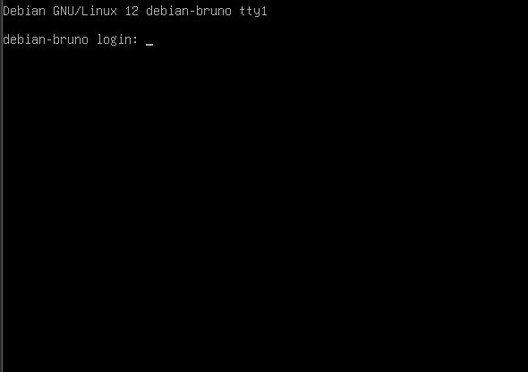

# Practica 1 UNIX

Este documento contiene las imágenes numeradas desde A1 hasta A45 ubicadas en `Prac1/P1`.

## Primer paso

Le primer paso para realizar esta y las demas practicas es necesario instalar VMware,
la instalacion se realizo por fuera, por lo que solo se presentara la instalacion de las
maquinas virtuales.

## Instalacion de Maquina virtual sin LVM

Se siguieron los siguientes pasos:

## Instalacion de Maquina virtual con LVM
La configuración de la máquina al momento de crearla es la misma. La instalación también es la misma solo hasta esta parte:

## Comandos LVM

### Introduccion

* sudo apt install lvm2
* sudo apt install xfsprogs
* sudo apt install util-linux

Estos comandos se utilizan para instalar diferentes paquetes en Debian que son necesarios para gestionar y trabajar con volúmenes lógicos (LVM), sistemas de archivos XFS, y utilidades básicas del sistema.

1. sudo apt install lvm2
    LVM2 (Logical Volume Manager 2): Este paquete incluye herramientas necesarias para gestionar volúmenes lógicos en Linux. Con lvm2, puedes crear, modificar, eliminar y consultar volúmenes físicos, grupos de volúmenes, y volúmenes lógicos.
2. sudo apt install xfsprogs
    XFSprogs: Este paquete proporciona un conjunto de herramientas para administrar el sistema de archivos XFS, que es conocido por su alta escalabilidad y rendimiento.
3. sudo apt install util-linux
    kvUtil-linux: Este es un paquete fundamental que incluye una amplia gama de utilidades del sistema que son esenciales para la administración diaria de un sistema Linux.

### Comandos

* lsblk: Este comando se utiliza para mostrar la información de los dispositivos de bloques, como discos y particiones.

* pvcreate: Este comando se utiliza para designar un disco o partición como un Physical Volume (PV), que es el bloque de construcción más básico en LVM. Al hacer esto, el disco o partición se prepara para ser incluido en un Volume Group (VG).

* vgs: Este comando muestra información sobre los grupos de volúmenes (VGs) disponibles en el sistema. Esto incluye detalles como el tamaño total del VG, el espacio libre disponible, y cuántos volúmenes lógicos (LVs) están asociados al VG.

* vgextend: Se usa para añadir capacidad a un grupo de volúmenes existente. Esto se logra agregando un nuevo Physical Volume (PV) al Volume Group (VG), lo que incrementa el tamaño total del VG.

* vgdisplay: Este comando proporciona una visualización detallada de la información de un grupo de volúmenes (VG) específico. Esto incluye detalles como el tamaño total, el espacio libre disponible, el número de volúmenes físicos (PVs) y lógicos (LVs), entre otros.

* lvs: Este comando muestra información sobre los volúmenes lógicos (LVs) dentro de los grupos de volúmenes (VGs). La salida incluye detalles como el nombre del LV, el tamaño, y el VG al que pertenece.

* lvextend: Este comando se utiliza para extender el tamaño de un volumen lógico (LV). Puedes añadir más espacio a un LV existente, usando el espacio libre disponible en el grupo de volúmenes (VG) al que pertenece el LV.

* xfs_growfs: Este comando se usa para expandir un sistema de archivos XFS en un volumen lógico (LV) recién extendido.

* df -h: Este comando muestra el uso de disco en una forma legible para humanos, con tamaños mostrados en MB, GB, etc.