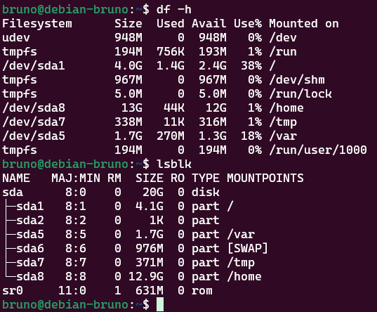
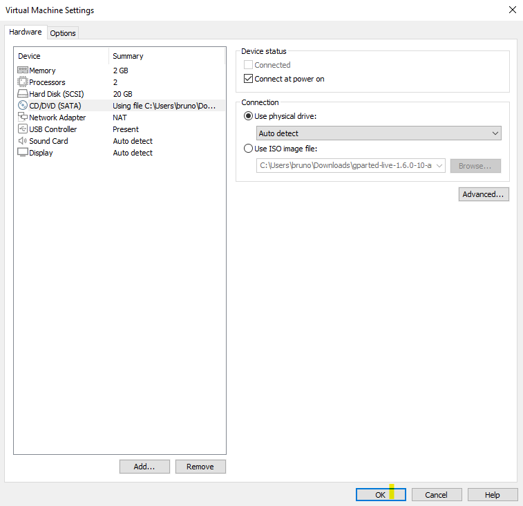
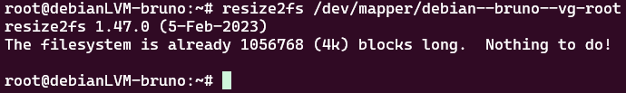

# Práctica 2 - GParted

## Introduccion

GParted (GNOME Partition Editor) es una herramienta de software libre que permite crear, redimensionar, mover, y gestionar particiones en discos duros y otros medios de almacenamiento. Es una aplicación basada en GUI (Interfaz Gráfica de Usuario), desarrollada para el entorno de escritorio GNOME, pero también puede usarse en otros entornos.

NOTA: Todas las capturas relacionadas con las mv se hicieron dentro de una conexion SSH a la mv, por temas de comodidad, la conexion SSH se hizo con WSL Ubuntu.

## Funcionalidades Principales de GParted

* Crear Particiones: Puedes crear nuevas particiones en discos sin particionar o en espacio no asignado.

* Redimensionar Particiones: Permite aumentar o reducir el tamaño de particiones existentes sin perder los datos.

* Mover Particiones: Puedes mover una partición de un lugar a otro en el disco. Eliminar Particiones: Borra particiones existentes

GParted está disponible en la mayoría de las distribuciones de Linux y también se ofrece como un sistema operativo en vivo llamado GParted Live, que se puede usar para gestionar particiones sin necesidad de instalarlo en tu sistema operativo. También se puede instalar en sistemas Debian con entorno gráfico.

## Pasos a seguir

1. Descargamos GParted

2. La sesión pasada montamos dos máquinas virtuales, una con LVM y otra sin esta característica para administrar volúmenes lógicos. Usaremos GParted en el sistema que instalamos sin LVM. Antes de utilizar dicha herramienta, entramos a nuestro sistema y ejecutamos "df -h" y "lsblk" para mostrar el uso del espacio en disco de los sistemas de archivos montados.

En dicha imagen podemos destacar lo siguiente para el comando df -h:

* udev: Sistema de archivos virtual que usa 948 MB y está montado en /dev.
* tmpfs: Sistema de archivos temporal, montado en /run con un tamaño de 194 MB.
* /dev/sda1: Partición de 4.0 GB, con 1.4 GB usados y 2.4 GB disponibles, montada en /.
* /dev/sda8: Partición de 13 GB, casi completamente disponible (12 GB), montada en /home.
* /dev/sda7: Partición de 338 MB, con 316 MB disponibles, montada en /tmp.
* /dev/sda5: Partición de 1.7 GB, con 1.3 GB disponibles, montada en /var.
Los sistemas de archivos tmpfs también están presentes en otros puntos de montaje como /dev/shm, /run/lock, y /run/user/1000, todos ellos son sistemas temporales que generalmente almacenan datos volátiles en memoria RAM.

En cuanto al comando lsblk, podemos destacar lo siguiente:

* sda: Disco duro principal con un tamaño de 20G.
* sda1: Partición de 4.1G montada en /.
* sda2: Partición de 1K (probablemente una partición extendida).
* sda5: Partición de 1.7G montada en /var.
* sda6: Partición de 976M usada como SWAP.
* sda7: Partición de 371M montada en /tmp.
* sda8: Partición de 12.9G montada en /home.
* sr0: Unidad de CD/DVD con un tamaño de 631M.

3. Después de haber comprobado esta información, apagamos la máquina virtual.

4. Vamos a la configuración de la máquina virtual, en la parte de CD/DVD seleccionamos la ISO de GParted.

NOTA: Es importante tener marcada la casilla "Connect at power on" para que al momento de iniciar la máquina virtual, muestre la instalación de GParted, si ese no es el caso, entramos al Boot menu y seleccionamos la opción de CD.

5. Iniciamos la máquina virtual. Cuando nos muestre la instalación de GParted, seleccionamos la primera opción.

Seleccionamos la opción "Don't touch keymap"

La instalación desplegará unas opciones que estás marcadas por default, aceptamos todas.

Después de haber aceptado y finalizado la instalación, GParted iniciará.

6. Una vez iniciado GParted, podemos ver la informacion del disco.

Podemos destacar la siguiente información:

Disco seleccionado: /dev/sda con una capacidad total de 20.00 GiB.

Particiones existentes:

* /dev/sda1: Partición primaria con sistema de archivos ext4, tamaño de 4.12 GiB, y montada como partición de arranque (boot).
* /dev/sda2: Partición extendida que abarca varias particiones lógicas.
* /dev/sda5: Partición lógica dentro de la extendida, con sistema de archivos ext4, y un tamaño de 1.68 GiB.
* /dev/sda6: Partición lógica usada como linux-swap con un tamaño de 976.00 MiB.
* /dev/sda7: Otra partición lógica con sistema de archivos ext4, y un tamaño de 371.00 MiB.
* /dev/sda8: Partición lógica con sistema de archivos ext4, y un tamaño de 12.88 GiB.
* Espacio sin asignar: Hay un pequeño espacio no asignado de 1.00 MiB al final del disco.
Este esquema de particiones es típico en instalaciones de Linux, con una partición primaria para el arranque, una partición extendida que contiene múltiples particiones lógicas, incluyendo particiones para el sistema de archivos, intercambio (swap), y otros propósitos.* 

7. Para comenzar con las modificaciones, comenzaremos modificando /dev/sda8.

La imagen muestra la ventana de "Resize/Move" (Redimensionar/Mover) en GParted para la partición /dev/sda8. En este cuadro de diálogo, se está ajustando el tamaño de la partición y la cantidad de espacio libre antes de ella.

* Free space preceding (MiB): Se está configurando 5987 MiB de espacio libre antes de la partición /dev/sda8. Esto implica que la partición se moverá hacia la derecha, dejando espacio no asignado delante de ella.
* New size (MiB): El nuevo tamaño de la partición se ha establecido en 7201 MiB. Esto indica que la partición se reducirá de su tamaño original para liberar espacio adicional.
* Free space following (MiB): El valor es 0, lo que significa que no se dejará espacio libre después de la partición.

Ahora muestra el resultado de las acciones que se muestran anteriormente.

Partición /dev/sda8:

Ahora ha sido movida hacia la derecha, liberando 5.85 GiB de espacio no asignado (unallocated) entre las particiones lógicas dentro de la extendida Además, el tamaño de la partición /dev/sda8 se ha reducido de 12.88 GiB a 7.03 GiB.Espacio no asignado:

Se ha creado un nuevo espacio no asignado de 5.85 GiB, que antes formaba parte de la partición /dev/sda8.

8. Una vez creado el nuevo espacio, modificaremos las particiones /dev/sda5, /dev/sda6, /dev/sda7.

* Primero modificamos /dev/sda7, moviendo su barra hasta la derecha para recorrerla, después aplicamos los cambios.

9. De esta manera, /dev/sda7 se recorrió y ahora está entre el nuevo espacio no asignado de 5.85 GiB y /dev/sda8. Repetimos este paso con /dev/sda5 y /dev/sda6. Esto con la intención de mover el nuevo espacio al lado de /dev/sda1.

10. Como último paso, modificaremos /dev/sda2 para poder asignar el espacio no asignado a /dev/sda1.

11. Asignamos la cantidad de la barra azul correspondiente a /dev/sda2 al mismo nivel que la barra amarilla correspondiente a /dev/sda5.

12. Después de aplicar los cambios, podremos asignar el espacio a /dev/sda1

13. Modificamos la barra de /dev/sda1 recorriéndola hasta la derecha, ya que dicho espacio corresponde al no asignado.

* Al aplicar los cambios, /dev/sda1 implementará el espacio libre al suyo. Pasando de pesar 4.12 GiB, a pesar 9.96 GiB.

14. Después de haber aplicado todos estos cambios, guardamos todo dando click en la flecha verde.

15. Cerramos la ventana de GParted y salimos de la herramienta dando click en Exit.

16. Volvemos a las settings de la máquina virtual y en la parte de CD/DVD, seleccionamos la opción "Use physical drive" para volver a iniciar el sistema de debian con la terminal.

17. Para comprobar los cambios realizados en GParted, volvemos a ejecutar los comandos "df -h" y "lsblk".

## Configuración de discos con LVM (solo para VMs con LVM)

Para esta parte, utilización de máquina virtual que creamos con las características de LVM.

NOTAS: Antes de iniciar el sistema, iremos a la parte de settings y realizaremos algunas modificaciones.

1. Iremos a la parte de Hard Disk y haremos la expansión del disco.

Una vez aplicados los cambios, iniciamos el sistema.

2. Después de haber iniciado el sistema, comprobamos la información del disco.

Comando df -h:

Muestra el uso del espacio en disco de cada sistema de archivos en formato legible por humanos.

* Los sistemas de archivos listados incluyen:

* udev, tmpfs, y otros sistemas temporales (/run, /dev/shm, etc.).

* El sistema de archivos principal en la raíz (/), montado en /dev/mapper/debian--vg-root.

* El directorio /home, montado en /dev/mapper/debian--vg-home.

* El directorio /boot, montado en /dev/sda1.

* Los directorios /tmp y /var, montados en volúmenes lógicos específicos (/dev/mapper/debian--vg-tmp y /dev/mapper/debian--vg-var).

* La columna Use% indica el porcentaje de espacio utilizado en cada sistema de archivos. Por ejemplo, / está utilizando el 36% de su capacidad total.

Comando lsblk:

Muestra una lista de dispositivos de bloques en el sistema, incluyendo discos duros, particiones y volúmenes lógicos.

Se muestra que el disco sda tiene 20G de capacidad, con varias particiones:

* sda1 (487M) montada en /boot.
* sda2 (1K) parece ser una partición de tipo extendida.
* sda5 (19.5G) que alberga los volúmenes lógicos de LVM.

3. Instalaremos las herramientas necesarias para poder ejecutar los comando, en este caso "parted", "e2fsprogs" y "echo".
* echo: Este comando ya está disponible por defecto en prácticamente cualquier sistema Linux, incluido Debian.

* parted: Herramienta para manipular particiones de discos. Debes instalar el paquete parted

* resize2fs: Herramienta para redimensionar sistemas de archivos ext2/ext3/ext4. Debes instalar el paquete e2fsprogs.

4. Verificar los dispositivos SCSI disponibles: Puedes listar los dispositivos SCSI disponibles en tu sistema con el siguiente comando.

5. Este comando le indica al sistema operativo que realice un "rescan" del dispositivo SCSI identificado por 32:0:0:0 y específicamente del disco sda. Esto es útil cuando has realizado cambios en la configuración del disco (por ejemplo, agregado espacio adicional a un disco virtual en un entorno como VMware) y quieres que el sistema detecte esos cambios sin reiniciar.

6. parted es una herramienta para manipular particiones en discos. El comando abre el disco /dev/sda para su modificación. El subcomando print muestra la tabla de particiones actual del disco.

7. Muestra la salida del comando parted utilizado para gestionar particiones en un disco en un entorno GNU/Linux. Específicamente, se está utilizando el disco /dev/sda, que es un disco virtual en VMware con una capacidad de 32.2 GB y un tamaño de sector de 512B.
El disco tiene una tabla de particiones de tipo MBR (msdos), y las particiones son las siguientes:

* Partición 1:
Inicio: 1049kB Fin: 512MB Tamaño: 511MB Tipo: Primaria Sistema de archivos: ext2 Flags: boot (indicando que es una partición de arranque)

* Partición 2:
Inicio: 513MB Fin: 21.5GB Tamaño: 21.0GB Tipo: Extendida No tiene un sistema de archivos directamente porque es un contenedor para particiones lógicas.

* Partición 5:
Inicio: 513MB Fin: 21.5GB Tamaño: 21.0GB Tipo: Lógica Sistema de archivos: lvm (indica que esta partición se usa para LVM, Logical Volume Management)

8. El comando resizepart 2 100% que aparece al final de la imagen está indicando que se intenta redimensionar la partición 2 (la extendida) para que ocupe el 100% del espacio disponible en el disco.

10. Este comando, ejecutado en un sistema operativo Debian con privilegios de root, está intentando expandir un volumen lógico (LV). Específicamente, busca aumentar el tamaño del LV denominado /dev/mapper/debian--vg-root hasta ocupar todo el espacio libre (100%FREE) disponible en el grupo de volúmenes (VG).
* lvextend: Esta es la herramienta de línea de comandos utilizada para administrar volúmenes lógicos en sistemas Linux que utilizan LVM (Logical Volume Manager).
* -L +100%FREE: Esta opción indica que se debe aumentar el tamaño del LV en una cantidad igual al 100% del espacio libre disponible en el VG.
* /dev/mapper/debian--vg-root: Este es el nombre del LV que se desea expandir. El nombre suele seguir un patrón que indica el VG al que pertenece (debian--vg) y el nombre del LV (root).

10. El comando resize2fs se utiliza en sistemas Linux para modificar el tamaño de un sistema de archivos ext2, ext3 o ext4.
* resize2fs /dev/mapper/debian--vg-root: Este es el comando principal. Se está intentando redimensionar el sistema de archivos ubicado en el dispositivo de bloque /dev/mapper/debian--vg-root. Este dispositivo, como vimos antes, es un volumen lógico (LV) manejado por LVM.
* resize2fs 1.47.0 (5-Feb-2023): Esta línea muestra la versión de la herramienta resize2fs que se está utilizando.
* The filesystem is already 1056768 (4k) blocks long. Nothing to do!: Este mensaje es el resultado de ejecutar el comando. Indica que el sistema de archivos ya tiene el tamaño máximo posible, por lo que no se realizaron cambios.