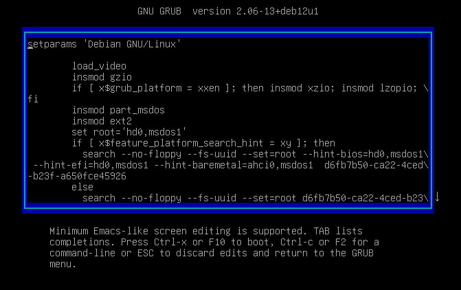
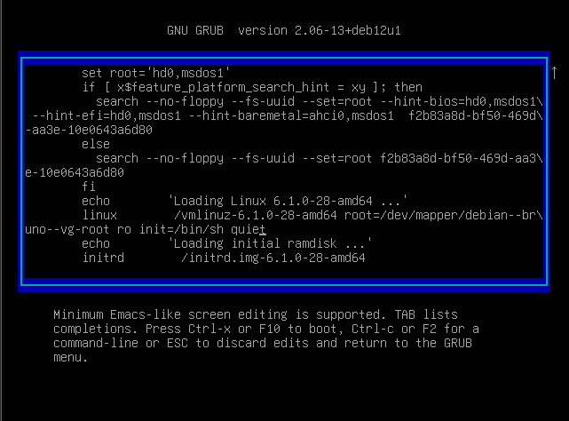
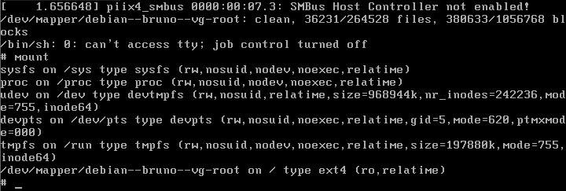
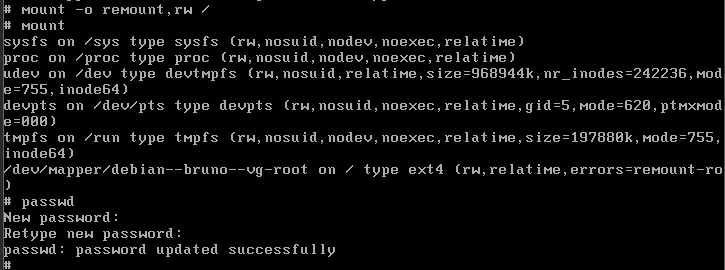
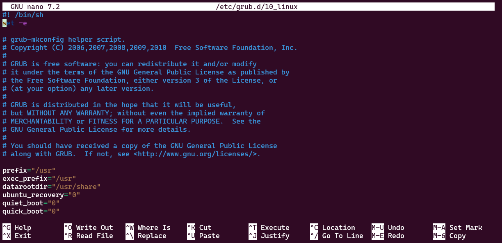
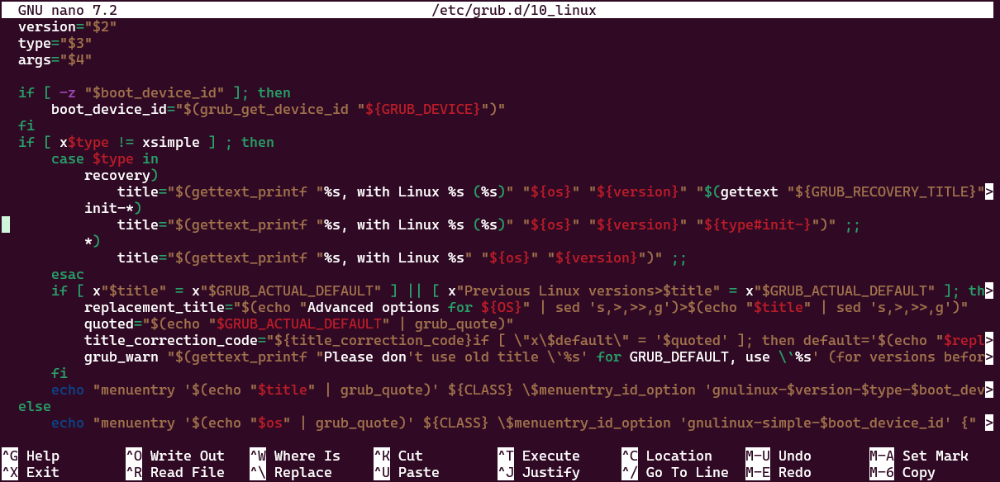
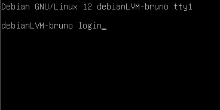

# Práctica 3 - Asegurar Bootloader

## Introduccion

### Bootloader
El bootloader, o cargador de arranque, es un programa esencial en el proceso de inicio de una computadora. Su función principal es cargar el sistema operativo en la memoria del sistema y transferirle el control para que pueda comenzar a ejecutarse.

### Carga el kernel y el initrd en memoria:
El bootloader es el primer software que se ejecuta al iniciar una computadora. Su función principal es cargar el núcleo del sistema operativo (el kernel) y el disco inicial (initrd) en la memoria. El kernel es el componente central del sistema operativo que gestiona el hardware y proporciona servicios a las aplicaciones, mientras que el initrd es un sistema de archivos en memoria utilizado para preparar el entorno antes de que el sistema operativo principal se inicie.

### Establece parámetros de inicio en el kernel:
Antes de cargar el kernel, el bootloader puede establecer parámetros de inicio que configuran cómo se debe iniciar el sistema. Estos parámetros pueden influir en el comportamiento del kernel y del sistema operativo durante el arranque.

### Una vez cargado en memoria ejecuta el kernel y transfiere el control del equipo:
Después de cargar el kernel y el initrd en la memoria, el bootloader transfiere el control al kernel. En este punto, el kernel toma el control del proceso de arranque y comienza a inicializar el sistema operativo.

### Es posible cambiar los parámetros de inicio para manipular el sistema:
Los parámetros de inicio pueden modificarse para influir en cómo el kernel y el sistema operativo se comportan durante el arranque. Esto puede ser útil para solucionar problemas, hacer pruebas o cambiar configuraciones específicas.

## Shell de root desde el bootloader

Modificando los parámetros de inicio del kernel es posible obtener un shell de root: Al modificar los parámetros de inicio del kernel desde el bootloader, puedes obtener acceso a una línea de comandos (shell) como usuario root. Esto es útil para realizar tareas administrativas, solucionar problemas o cambiar configuraciones sin necesidad de iniciar el sistema operativo normalmente.

### Pasos a seguir
1. Al presionar la tecla "e" en el inicio de Debian, accedes al menú de edición de las entradas del GRUB (GRand Unified Bootloader). Este menú te permite modificar temporalmente los parámetros de arranque de Debian, como las opciones del kernel o las rutas de los dispositivos. Los cambios que realices en este menú no se guardan de forma permanente, solo se aplican para esa sesión de arranque.

2. init=/bin/sh:
Esta es una opción del kernel que se utiliza para especificar qué programa debe ejecutarse como proceso de inicialización (PID 1) durante el arranque. En este caso, se le está diciendo al kernel que, en lugar de iniciar el sistema normalmente, cargue una shell /bin/sh. Este método se utiliza frecuentemente para entrar en un modo de recuperación o para realizar tareas de mantenimiento, ya que carga un entorno mínimo con acceso a la shell.

3. Presionamos ctrl x

4. mount

El comando mount se utiliza para montar sistemas de archivos en Linux. Esto significa que se asocia un sistema de archivos con un punto de montaje en el árbol de directorios, lo que permite acceder a su contenido. Sin argumentos, mount muestra una lista de todos los sistemas de archivos montados en ese momento.

5. mount -o remount,rw /:

Este comando vuelve a montar el sistema de archivos raíz / con permisos de lectura y escritura. Por defecto, algunos sistemas pueden arrancar con el sistema de archivos raíz montado en modo de solo lectura para realizar chequeos o reparaciones antes de permitir modificaciones. Este comando cambia ese estado a lectura-escritura (rw), lo que permite modificar archivos en el sistema de archivos raíz.

6. passwd

7. Reiniciamos la maquina
8. Modificar opciones avanzadas, sudo nano /etc/grub.d/10_linux
El comando sudo nano /etc/grub.d/10_linux abre el archivo 10_linux, ubicado en el directorio /etc/grub.d/, en el editor de texto nano con permisos de superusuario.

Este archivo es parte de la configuración de GRUB (GRand Unified Bootloader) en sistemas Linux. Específicamente, el archivo 10_linux se encarga de detectar y generar entradas en el menú de GRUB para los sistemas operativos Linux instalados en la máquina. Cuando ejecutas sudo update-grub, el contenido de este archivo se utiliza para construir el archivo de configuración principal de GRUB.

9. Vamos a la linea 132

10. --unrestricted antes de la etiqueta ${CLASS}:

En el contexto de GRUB, la opción --unrestricted se puede agregar a la configuración de una entrada de menú para hacerla accesible sin restricciones, es decir, no requiere autenticación (contraseña) para ser seleccionada desde el menú de GRUB. La etiqueta "CLASS" en los scripts de GRUB se utiliza para definir clases de entrada de menú, que pueden ser utilizadas para aplicar configuraciones específicas a diferentes entradas del menú de arranque. Colocar --unrestricted antes de ${CLASS} significa que esa entrada de menú específica se podrá seleccionar libremente en GRUB, incluso si otras entradas requieren autenticación.

11. Despues de haber guardado los cambios, ponemos el comando sudo update-grub

## Protección con Contraseña de GRUB

## Pasos a seguir

1. sudo grub-mkpasswd-pbkdf2
El comando sudo grub-mkpasswd-pbkdf2 se utiliza para generar una contraseña cifrada para usar en la configuración de GRUB. Específicamente, este comando genera un hash PBKDF2 (Password-Based Key Derivation Function 2) de la contraseña que proporcionas. Esta hash se puede usar para proteger el menú de GRUB con una contraseña.

2. sudo nano /etc/grub.d/40_custom
El comando sudo nano /etc/grub.d/40_custom abre el archivo 40_custom en el directorio /etc/grub.d/ usando el editor de texto nano con permisos de superusuario.

El archivo 40_custom es un archivo de configuración utilizado por GRUB para añadir entradas personalizadas al menú de arranque. Este archivo se usa para definir entradas de menú adicionales o personalizadas que no se generan automáticamente por otros scripts en /etc/grub.d/.

3. Colocamos el usuario root y la contraseña encriptada. Finalmente, guardamos el script y usamos sudo update-grub.

4. Reiniciamos el sistema, comprobamos que al momento de que inicie el sistema, será de forma normal, pidiendo nuestro usuario y contraseña.

5. Volvemos a reiniciar el sistema y comprobaremos que al intentar ingresar en el menú de edición de las entradas del GRUB, esta pedida el usuario root y la contraseña que creamos para generar la contraseña encriptada.

