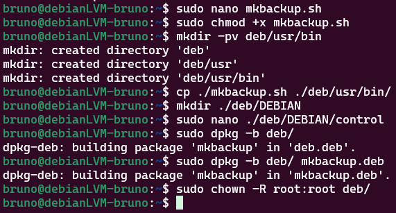
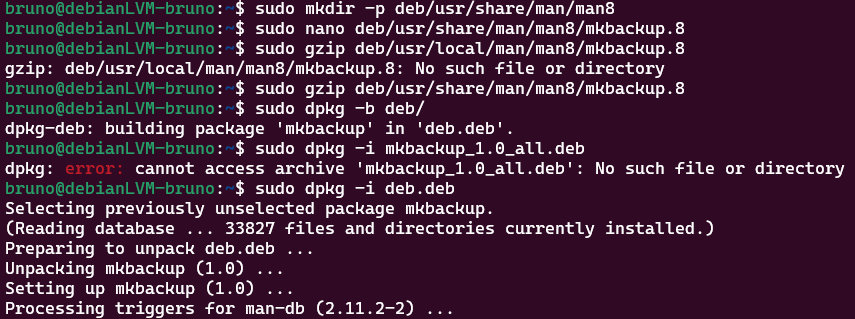
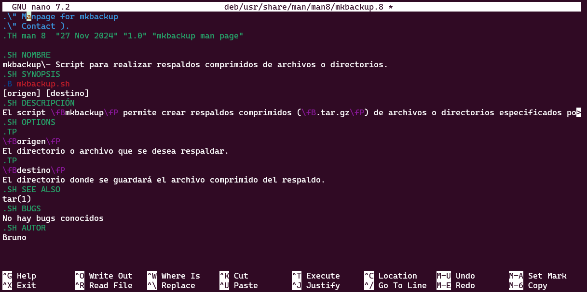
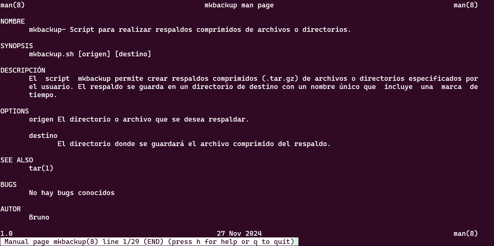

# Práctica 4

## Introduccion

### Paquete .deb:

Son los paquetes de software utilizados por Debian y sus derivados (como Ubuntu). Estos paquetes contienen programas, bibliotecas y otros archivos necesarios para instalar software en el sistema. Los archivos .deb incluyen metadatos que describen el paquete, scripts que se ejecutan en varias etapas de la instalación/desinstalación (como postinst y prerm), y los archivos binarios o de configuración que se instalarán.

### Páginas de manual (man):
Son los documentos que proporcionan información sobre comandos, programas, configuraciones, y otros aspectos del sistema. Estas páginas están organizadas por secciones y se pueden acceder a través del comando man seguido del nombre del comando o tema deseado. Cada paquete .deb puede incluir sus propias páginas de manual, que suelen instalarse en directorios como /usr/share/man/.

Al hablar de ambos juntos, se podría estar refiriendo a cómo empaquetar un programa o script dentro de un archivo .deb, y asegurarse de que las páginas de manual estén disponibles y comprimidas correctamente para que el usuario pueda acceder a la documentación del software instalado.

## Comandos previos de deb:

* nano mkbackup.sh:
Abre el editor de texto nano para crear o editar el archivo mkbackup.sh. Este archivo es un script que probablemente contiene comandos para realizar un respaldo del personalizado.

* chmod +x mkbackup.sh:
Otorga permisos de ejecución al archivo mkbackup.sh, lo que permite que se pueda ejecutar como un programa o script.

* mkdir -p deb/usr/bin:
Crea el directorio deb/usr/bin, incluyendo cualquier directorio padre necesario. Este es el directorio donde se colocará el script mkbackup.sh en la estructura del paquete.

* cp ./mkbackup.sh ./deb/usr/bin:
Copia el script mkbackup.sh al directorio deb/usr/bin, dentro de la estructura que representará el paquete .deb.

* mkdir ./deb/DEBIAN:
Crea el directorio DEBIAN dentro del directorio deb. Este directorio es crucial para un paquete .deb, ya que contendrá archivos de control como control y otros posibles scripts como postinst o prerm.

* nano ./deb/DEBIAN/control:
Abre nano para crear o editar el archivo control dentro del directorio DEBIAN. Este archivo contiene metadatos sobre el paquete, como su nombre, versión, descripción, etc.

* dpkg -b deb/:
Construye un archivo de paquete .deb a partir de los archivos y directorios dentro de deb/. Esto genera un archivo .deb en el mismo directorio.

* dpkg -b deb/ mkbackup.deb:
Similar al comando anterior, pero esta vez especifica el nombre del archivo .deb que se generará, en este caso, mkbackup.deb.

* sudo chown -R root:root deb/:
Cambia el propietario y grupo de todos los archivos y directorios dentro de deb/ a root. Esto es importante para asegurar que el paquete se instale con los permisos correctos.

## Comandos para man:

* mkdir -p deb/usr/share/man/man8: Crea un directorio llamado man8 dentro de la ruta deb/usr/share/man/. La opción -p asegura que se creen todos los directorios intermedios necesarios si no existen.

* sudo nano deb/usr/share/man/man8/mkbackup.8: Abre el editor de texto nano con permisos de superusuario (sudo) para editar o crear el archivo mkbackup.8 en el directorio deb/usr/share/man/man8/. Este archivo normalmente contendrá la página de manual para el comando mkbackup.

* sudo gzip deb/usr/local/man/man8/mkbackup.8: Comprime el archivo mkbackup.8 usando gzip, resultando en un archivo con la extensión .8.gz. Sin embargo, parece haber un error en la ruta, ya que se creó el archivo en deb/usr/share/man/man8/ y aquí se está intentando comprimir desde deb/usr/local/man/man8/. Si la intención es comprimir el archivo que acabas de editar, la ruta correcta sería deb/usr/share/man/man8/mkbackup.8.

* sudo chown -R root:root deb/: Cambia el propietario y grupo de todo el contenido en el directorio deb/ a root, de forma recursiva (-R).

* dpkg -b deb/ .: Crea un paquete .deb a partir del contenido del directorio deb/ en el directorio actual. El paquete generado tendrá el mismo nombre que el directorio deb/ (por ejemplo, deb.deb).

* sudo dpkg -i mkbackup_1.0_all.deb: Instala el paquete .deb llamado mkbackup_1.0_all.deb en el sistema, usando permisos de superusuario (sudo).

* man mkbackup: Muestra la página de manual del comando mkbackup, asumiendo que el archivo mkbackup.8.gz fue instalado correctamente en el directorio de manual adecuado.

