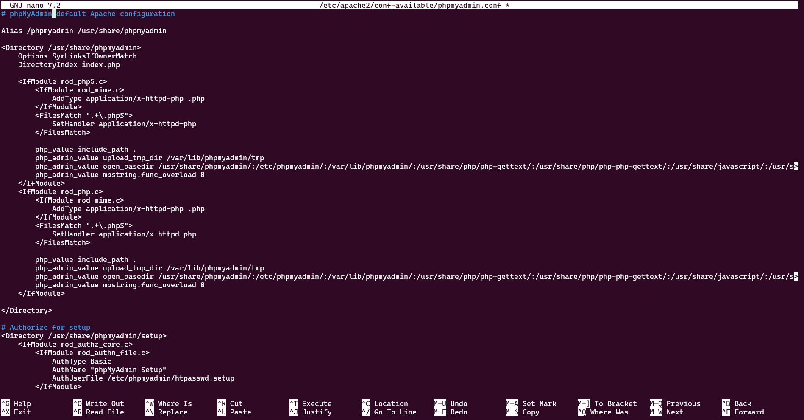

# Práctica 6 - Cómo instalar phpMyAdmin desde el código fuente

## Requisitos previos

Primero ejecutaremos los comandos que están orientados a instalar y configurar un entorno LAMP (Linux, Apache, MySQL/MariaDB, PHP) en un servidor Debian/Ubuntu. Este entorno es comúnmente utilizado para el desarrollo y despliegue de aplicaciones web.

El servidor web Apache es uno de los más populares del mundo. Está bien documentado y ha sido ampliamente utilizado durante gran parte de la historia de la web, lo que lo convierte en una gran opción por defecto para alojar un sitio web.

Empieza por actualizar la caché del gestor de paquetes. Si es la primera vez que utiliza sudo en esta sesión, se le pedirá que proporcione su contraseña de usuario para confirmar que tiene los privilegios adecuados para gestionar paquetes del sistema con apt.

### sudo apt update:


### sudo apt install apache2:
Instalamos el servidor web Apache2. Apache es un servidor web que permite servir páginas web a los visitantes.


En Debian 10, el metapaquete mysql-server, que se usaba tradicionalmente para instalar el servidor MySQL, fue reemplazado por default-mysql-server. Este metapaquete hace referencia a MariaDB, una bifurcación comunitaria del servidor MySQL original de Oracle, y es actualmente el servidor de bases de datos compatible con MySQL por omisión disponible en los repositorios de gestores de paquetes basados en Debian.

### sudo apt install mariadb-server:
Instalamos el servidor de base de datos MariaDB. MariaDB es un sistema de gestión de bases de datos derivado de MySQL y se utiliza para almacenar los datos de la aplicación web.


### sudo mysql_secure_installation:
Configuramos la seguridad del servidor MariaDB. Este script interactivo ayuda a establecer una contraseña para el usuario root de MariaDB, eliminar usuarios anónimos, deshabilitar el inicio de sesión remoto para root, y eliminar la base de datos de prueba.


Este script le llevará a través de una serie de preguntas donde puede hacer algunos cambios a su configuración de MariaDB. El primer mensaje le pedirá que introduzca la contraseña de root de la base de datos. Esto no debe confundirse con la raíz del sistema. El usuario raíz de la base de datos es un usuario administrativo con todos los privilegios sobre el sistema de base de datos. Como usted instaló MariaDB recientemente y no ha hecho ningún cambio de configuración todavía, esta contraseña estará en blanco, así que presione ENTER en el prompt.


Cuando haya terminado, iniciamos sesión en la consola MariaDB:

### sudo mariadb:
Iniciamos el cliente de línea de comandos de MariaDB para ejecutar comandos SQL en la base de datos.


Salimos de la consola MariaDB con exit.

Tienemos Apache instalado para servir tu contenido y MariaDB instalado para almacenar y gestionar tus datos. PHP es el componente de su configuración que procesará código para mostrar contenido dinámico al usuario final. Podemos ejecutar scripts, conectarse a tus bases de datos MariaDB para obtener información, y entregar el contenido procesado a tu servidor web para que lo muestre.

### sudo apt install php libapache2-mod-php php-mysql:
Instalamos PHP y las bibliotecas necesarias para que PHP funcione con Apache y MariaDB. PHP es un lenguaje de programación del lado del servidor que permite la creación de contenido dinámico.


### sudo nano /etc/apache2/mods-enabled/dir.conf:
Abrimos el archivo de configuración de Apache relacionado con los módulos habilitados, específicamente para la directiva de orden de indexación de directorios. Puede ser modificado para que Apache sirva archivos index.php antes que index.html, por ejemplo.


Muevmos el archivo de índice PHP a la primera posición después de la especificación DirectoryIndex, como en lo siguiente:


Guardamos y cierra el archivo.

### sudo systemctl reload apache2:
Recargamos la configuración de Apache sin detener el servidor. Esto es necesario después de realizar cambios en los archivos de configuración para que surtan efecto.

### sudo systemctl status apache2:
Muestramos el estado actual del servicio Apache, permitiendo verificar si está activo y funcionando correctamente.


## Instalación de phpMyAdmin y paquetes recomendados

### sudo apt install php-mbstring php-zip php-gd:
Instala extensiones adicionales de PHP necesarias para el funcionamiento de phpMyAdmin. Estas extensiones permiten manejar cadenas de caracteres (mbstring), archivos comprimidos (zip) y procesamiento de imágenes (gd).


A continuación, podemos instalar phpMyAdmin. En el momento de escribir esto, phpMyAdmin no está disponible en los repositorios predeterminados de Debian, por lo que necesitará descargar el código fuente a su servidor desde el sitio web de phpMyAdmin.

Para ello, vaya a la página de descargas de phpMyAdmin, baje hasta la tabla con los enlaces de descarga de la última versión estable y copie el enlace de descarga que termina en tar.gz. Este enlace apunta a un archivo conocido como tarball que, al ser extraído, creará una serie de ficheros en su sistema. En el momento de escribir estas líneas, la última versión es la 4.9.7.

`wget https://files.phpmyadmin.net/phpMyAdmin/4.9.7/phpMyAdmin-4.9.7-all-languages.tar.gz`

Descarga el archivo comprimido de phpMyAdmin en la versión 4.9.7. Este archivo contiene el software necesario para instalar la herramienta.


### tar xvf phpMyAdmin-4.9.7-all-languages.tar.gz:
Extrae el contenido del archivo descargado, dejando los archivos de phpMyAdmin disponibles para ser utilizados.


A continuación, ejecute el siguiente comando. Esto moverá el directorio phpMyAdmin-4.9.7-all-languages y todos sus subdirectorios al directorio /usr/share/, la ubicación donde phpMyAdmin espera encontrar sus ficheros de configuración por defecto. También renombrará el directorio en su lugar a sólo phpmyadmin.

### sudo mv phpMyAdmin-4.9.7-all-languages/ /usr/share/phpmyadmin:
Mueve la carpeta extraída a /usr/share/phpmyadmin, que es una ubicación estándar para aplicaciones web en el servidor.


Con eso, has instalado phpMyAdmin, pero hay una serie de cambios de configuración que debes hacer para poder acceder a phpMyAdmin a través de un navegador web.

Cuando se instala phpMyAdmin con un gestor de paquetes, como uno podría hacer en un entorno Ubuntu, phpMyAdmin se pone por defecto en un modo de «Configuración Cero» que realiza varias acciones automáticamente para configurar el programa. Como en esta guía lo instalamos desde el código fuente, tendremos que realizar esos pasos manualmente.

### sudo mkdir -p /var/lib/phpmyadmin/tmp:
Crea un directorio temporal para phpMyAdmin. Este directorio es necesario para almacenar archivos temporales que phpMyAdmin pueda necesitar.

### sudo chown -R www-data:www-data /var/lib/phpmyadmin:
Cambia el propietario del directorio temporal a www-data, el usuario con el que corre Apache. Esto garantiza que phpMyAdmin pueda acceder y manipular los archivos en el directorio.

## sudo cp /usr/share/phpmyadmin/config.sample.inc.php /usr/share/phpmyadmin/config.inc.php:
Copia el archivo de configuración de ejemplo de phpMyAdmin a un archivo de configuración real, que luego se puede editar para personalizar la configuración.


phpMyAdmin utiliza por defecto el método de autenticación por cookies, que le permite iniciar sesión en phpMyAdmin como cualquier usuario válido de MariaDB con la ayuda de cookies. En este método, la contraseña de usuario de MariaDB se almacena y encripta con el algoritmo Advanced Encryption Standard (AES) en una cookie temporal.

### sudo apt install pwgen:
Instala la herramienta pwgen, que se utiliza para generar contraseñas aleatorias.

### pwgen -s 32 1:
Genera una cadena segura de 32 caracteres para ser utilizada como valor para blowfish_secret.


### sudo nano /usr/share/phpmyadmin/config.inc.php
Abra este archivo con su editor de texto preferido. Aquí, vamos a utilizar nano:


Históricamente, phpMyAdmin usaba el cifrado Blowfish para este propósito, y esto todavía se refleja en su fichero de configuración. Desplácese hacia abajo hasta la línea que comienza con:

`$cfg['blowfish_secret'].`

Se ve asi:


Establecemos una cadena de 32 caracteres aleatorios para la configuración de blowfish_secret, lo cual es necesario para la autenticación con cookies en phpMyAdmin.

A continuación, nos desplácese hacia abajo hasta el comentario que dice /_ User used to manipulate with storage _/. Esta sección incluye algunas directivas que definen un usuario de base de datos MariaDB llamado pma que realiza ciertas tareas administrativas dentro de phpMyAdmin. De acuerdo con la documentación oficial, esta cuenta de usuario especial no es necesaria en casos donde sólo un usuario accederá a phpMyAdmin, pero es recomendada en escenarios multiusuario.

Descomentamos las directivas controluser y controlpass eliminando las barras anteriores. Luego actualice la directiva controlpass para que apunte a una contraseña segura de su elección. Si no lo hace, la contraseña por defecto permanecerá en su lugar y usuarios desconocidos podrían acceder fácilmente a su base de datos a través de la interfaz phpMyAdmin.


Debajo de esta sección, encontramos otra sección precedida por un comentario que dice /_ Storage database and tables _/. Esta sección incluye una serie de directivas que definen el almacenamiento de configuración de phpMyAdmin, una base de datos y varias tablas usadas por el usuario administrativo de la base de datos pma. Estas tablas habilitan un número de características en phpMyAdmin, incluyendo Marcadores, comentarios, generación de PDF, y más.

Descomentamos cada línea en esta sección eliminando las barras al principio de cada línea para que se vea así:


Estas tablas aún no existen, pero las crearemos en breve.

Por último, nos desplasamos hasta la parte inferior del archivo y añada la siguiente línea. Esto configurará phpMyAdmin para usar el directorio /var/lib/phpmyadmin/tmp que creó antes como directorio temporal. phpMyAdmin usará este directorio temporal como caché de plantillas, lo que permite una carga más rápida de las páginas:


A continuación, tendrá que crear la base de datos y las tablas de almacenamiento de phpMyAdmin. Cuando instaló phpMyAdmin en el paso anterior, venía con un archivo llamado create_tables.sql. Este archivo SQL contiene todos los comandos necesarios para crear la base de datos de almacenamiento de configuración y las tablas que phpMyAdmin necesita para funcionar correctamente.

### sudo mariadb < /usr/share/phpmyadmin/sql/create_tables.sql:
Ejecutamos un script SQL para crear las tablas necesarias en MariaDB para el correcto funcionamiento de phpMyAdmin.


Desde el prompt, ejecutamos el siguiente comando para crear el usuario pma y otorgarle los permisos apropiados. Nos asegúramos de cambiar la contraseña para alinearla con la contraseña que definió en el archivo config.inc.php:


phpMyAdmin está ahora completamente instalado y configurado en su servidor. Sin embargo, su servidor Apache aún no sabe cómo servir la aplicación. Para resolver esto, vamos a crear un archivo de configuración de Apache para ello.

Cuando se instala phpMyAdmin desde los repositorios por defecto, el proceso de instalación crea un fichero de configuración de Apache automáticamente y lo coloca en el directorio /etc/apache2/conf-enabled/. Sin embargo, como hemos instalado phpMyAdmin desde el código fuente, tendremos que crear y habilitar este archivo manualmente.

Creamos un archivo llamado phpmyadmin.conf en el directorio /etc/apache2/conf-available/:


### sudo nano /etc/apache2/conf-available/phpmyadmin.conf:
Creamos o editamos el archivo de configuración de Apache para phpMyAdmin. Esto puede incluir la configuración de rutas y permisos.


Añadimos el siguiente texto al archivo

```apacheconf
Alias /phpmyadmin /usr/share/phpmyadmin

<Directory /usr/share/phpmyadmin>
    Options SymLinksIfOwnerMatch
    DirectoryIndex index.php

    <IfModule mod_php5.c>
        <IfModule mod_mime.c>
            AddType application/x-httpd-php .php
        </IfModule>
        <FilesMatch ".+\.php$">
            SetHandler application/x-httpd-php
        </FilesMatch>

        php_value include_path .
        php_admin_value upload_tmp_dir /var/lib/phpmyadmin/tmp
        php_admin_value open_basedir /usr/share/phpmyadmin/:/etc/phpmyadmin/:/var/lib/phpmyadmin/:/usr/share/php/php-gettext/:/usr/share/php/php-php-gettext/:/usr/share/javascript/:/usr/share/php/tcpdf/:/usr/share/doc/phpmyadmin/:/usr/share/php/phpseclib/
        php_admin_value mbstring.func_overload 0
    </IfModule>
    <IfModule mod_php.c>
        <IfModule mod_mime.c>
            AddType application/x-httpd-php .php
        </IfModule>
        <FilesMatch ".+\.php$">
            SetHandler application/x-httpd-php
        </FilesMatch>

        php_value include_path .
        php_admin_value upload_tmp_dir /var/lib/phpmyadmin/tmp
        php_admin_value open_basedir /usr/share/phpmyadmin/:/etc/phpmyadmin/:/var/lib/phpmyadmin/:/usr/share/php/php-gettext/:/usr/share/php/php-php-gettext/:/usr/share/javascript/:/usr/share/php/tcpdf/:/usr/share/doc/phpmyadmin/:/usr/share/php/phpseclib/
        php_admin_value mbstring.func_overload 0
    </IfModule>

</Directory>

# Authorize for setup
<Directory /usr/share/phpmyadmin/setup>
    <IfModule mod_authz_core.c>
        <IfModule mod_authn_file.c>
            AuthType Basic
            AuthName "phpMyAdmin Setup"
            AuthUserFile /etc/phpmyadmin/htpasswd.setup
        </IfModule>
        Require valid-user
    </IfModule>
</Directory>

# Disallow web access to directories that don't need it
<Directory /usr/share/phpmyadmin/templates>
    Require all denied
</Directory>
<Directory /usr/share/phpmyadmin/libraries>
    Require all denied
</Directory>
<Directory /usr/share/phpmyadmin/setup/lib>
    Require all denied
</Directory>
```

Este es el fichero de configuración por defecto de phpMyAdmin Apache que se encuentra en instalaciones Ubuntu, aunque también será adecuado para una instalación Debian.



### sudo a2enconf phpmyadmin.conf:
Habilita la configuración de phpMyAdmin en Apache.

### sudo systemctl reload apache2:
Recarga la configuración de Apache para aplicar los cambios y hacer que phpMyAdmin esté accesible en el servidor web.


A continuación, accedemos a la pantalla de inicio de sesión de phpMyAdmin navegando a la siguiente URL:

`192.168.159.131/phpmyadmin`


Iniciamos sesión en la interfaz con el nombre de usuario y la contraseña de MariaDB que se configuró. Después de iniciar sesión, vemos la interfaz de usuario:


