# Práctica 7

## Fail2ban

Los siguientes comandos configuran y gestionan Fail2Ban, una herramienta de seguridad en Linux diseñada para prevenir ataques de fuerza bruta y otros intentos de acceso no autorizado. Fail2Ban funciona principalmente monitoreando los registros del sistema y tomando medidas cuando detecta actividad sospechosa, como múltiples intentos fallidos de inicio de sesión.

### `sudo aptitude update`
Actualiza los índices de los repositorios de paquetes usando aptitude. Es un paso redundante aquí, pero asegura que la información esté actualizada si fuera necesario instalar otros paquetes.

### `sudo aptitude install fail2ban`
Instala el paquete fail2ban usando el gestor de paquetes aptitude, que maneja dependencias de manera más interactiva y permite opciones avanzadas.


### `cd /etc/fail2ban`
Cambia el directorio de trabajo al de configuración de Fail2Ban (/etc/fail2ban).

### `sudo cp jail.conf jail.local`
Crea una copia de jail.conf con el nombre jail.local. Este archivo (jail.local) es donde se recomienda hacer modificaciones personalizadas de Fail2Ban, para que las actualizaciones del sistema no sobrescriban tus configuraciones.

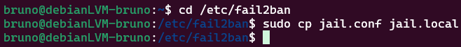

### `sudo nano jail.local`

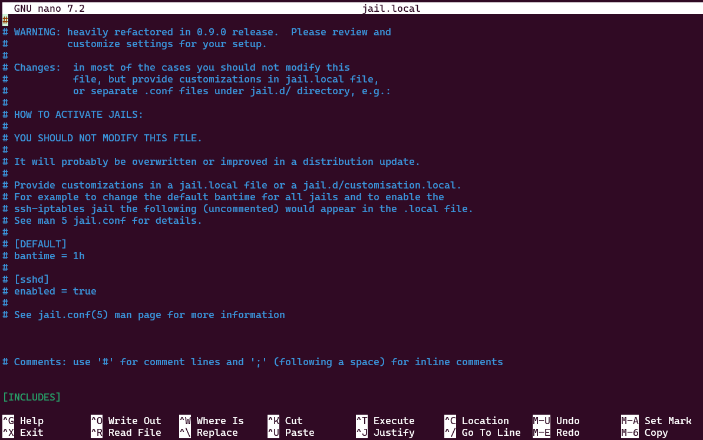

Abre el archivo jail.local en el editor de texto nano con permisos de superusuario para hacer ajustes. Aquí puedes configurar Fail2Ban, como qué servicios proteger (por ejemplo, SSH) y la duración de los bloqueos.

``` 
    # backend = %(sshd_backend)s
    backend = systemd
```

backend = systemd En Fail2Ban, la línea backend = systemd especifica el método que Fail2Ban usará para leer los registros del sistema. La opción systemd indica que Fail2Ban obtendrá la información de los registros directamente desde journald (el servicio de registros de systemd). Esto es útil en sistemas modernos que utilizan systemd, ya que permite un monitoreo más eficiente y directo de los servicios.


### `cd`
Cambia el directorio de trabajo de vuelta al directorio personal del usuario.

### `sudo systemctl restart fail2ban`
Reinicia el servicio Fail2Ban para aplicar cualquier cambio hecho en el archivo de configuración (jail.local).

### `sudo systemctl status fail2ban`
Verifica nuevamente el estado de Fail2Ban después del reinicio.

### `sudo systemctl start fail2ban`
Inicia el servicio Fail2Ban si estaba detenido.

### `sudo systemctl status fail2ban`
Verifica nuevamente el estado del servicio Fail2Ban.

### `sudo fail2ban-client status sshd`
Consulta el estado del filtro de Fail2Ban para el servicio SSHD, mostrando estadísticas como IPs bloqueadas y tiempo de los bloqueos.

### `sudo fail2ban-client set sshd unbanip [IP]`
Desbloquea manualmente una dirección IP específica que había sido bloqueada para el servicio SSH.

### `sudo fail2ban-client status sshd`
Revisa nuevamente el estado de Fail2Ban en el servicio SSHD para verificar los cambios después de desbloquear una IP.

### `sudo systemctl restart fail2ban.service`
Reinicia el servicio Fail2Ban, asegurando que cualquier cambio o ajuste adicional se aplique correctamente.

Fail2Ban es útil para proteger servicios como SSH de ataques externos al bloquear las IPs que muestran patrones de actividad sospechosa. Esta configuración que has hecho monitorea y protege el servicio SSH de tu sistema y permite una administración flexible de las IPs bloqueadas, facilitando así la seguridad de tu sistema. 

A continuacion las imagenes de la ejecucion de los comandos previamente mencionados
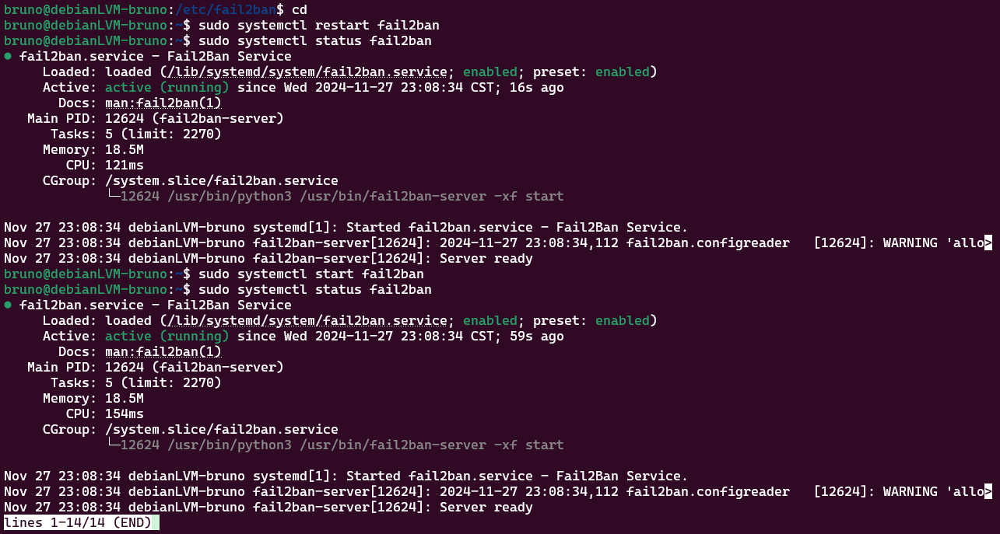
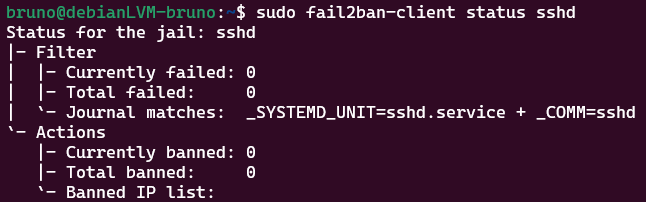
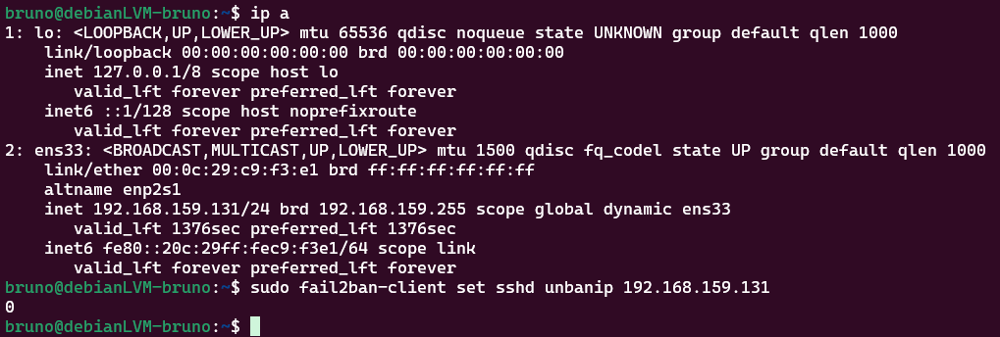
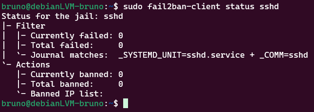
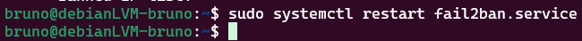

## ClamaV

### `sudo aptitude install clamav clamav-daemon`
Instala el antivirus ClamAV y su servicio clamav-daemon, que permite realizar escaneos en segundo plano y con mayor rapidez.

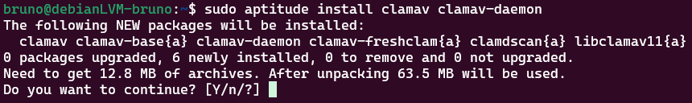

### `sudo dpkg-reconfigure clamav-daemon`
Reconfigura el paquete clamav-daemon, lo que te permite ajustar configuraciones específicas del servicio, como opciones de escaneo en tiempo real o configuración de red.

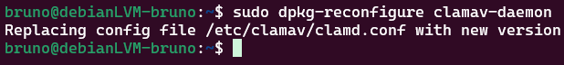

### `sudo systemctl status clamav-freshclam.service`
Verifica el estado del servicio clamav-freshclam, que se encarga de actualizar automáticamente la base de datos de firmas de virus en ClamAV.

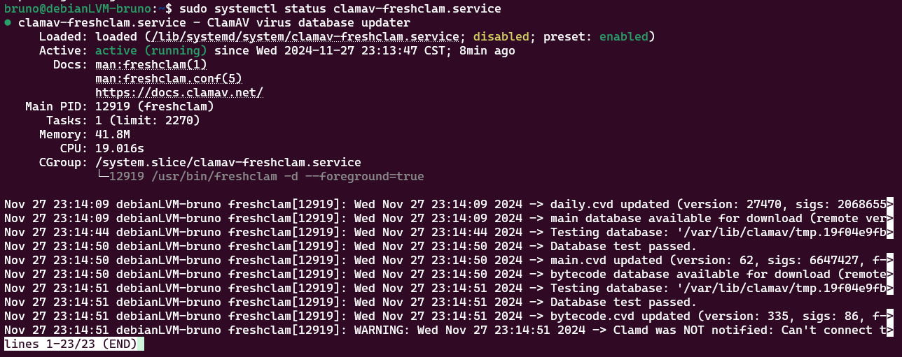

### `sudo systemctl enable clamav-freshclam.service`
Activa el servicio clamav-freshclam para que se inicie automáticamente al arrancar el sistema.

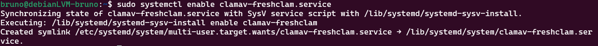

### `sudo freshclam`
Ejecuta manualmente la actualización de la base de datos de virus de ClamAV usando freshclam, en caso de que el servicio no esté activo o para forzar una actualización inmediata.
### `sudo systemctl stop clamav-freshclam.service`
Detiene el servicio clamav-freshclam como superusuario, similar al comando anterior.
### `sudo systemctl start clamav-freshclam.service`
Inicia el servicio clamav-freshclam si aún no está activo.

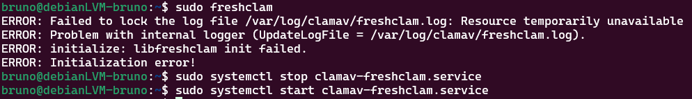

### `sudo nano /etc/cron.daily/clamavscan.sh`
Crea o edita el archivo de script clamavscan.sh en el directorio de tareas diarias. Este archivo puede contener instrucciones para realizar un escaneo diario con ClamAV.


Añadimos los siguiente al arhcivo:
```
#!/bin/bash
clamscan /home/
```

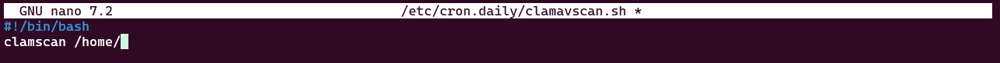

Actualizamos los permisos
`sudo chmod +x /etc/cron.daily/clamavscan.sh`
 
Asigna permisos de ejecución al script clamavscan.sh para que el sistema pueda ejecutarlo automáticamente cada día.

### `sudo /etc/cron.daily/clamavscan.sh`
Ejecuta el script clamavscan.sh manualmente para verificar que funcione correctamente. Esto debería iniciar un escaneo antivirus si el script está bien configurado.

Estos comandos configuran ClamAV y su servicio de actualización freshclam. ClamAV protege el sistema escaneando archivos en busca de malware y virus, mientras que el servicio freshclam asegura que la base de datos de firmas de virus esté actualizada.
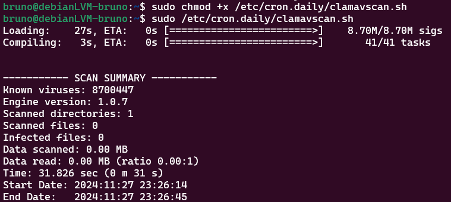

## Postfix y Logwatch

### `sudo aptitude install mailutils postfix logwatch`
Instala tres paquetes clave:

* Mailutils: Un conjunto de herramientas de correo para enviar y leer correos desde la línea de comandos.

* Postfix: Un servidor de correo que gestiona el envío y recepción de correos electrónicos.

* Logwatch: Una herramienta que analiza los registros del sistema y genera informes resumidos o detallados sobre la actividad.

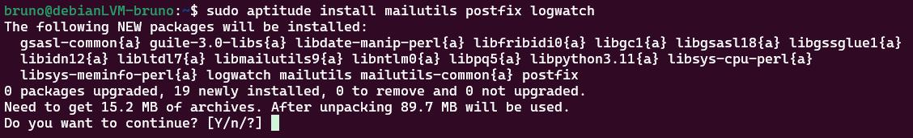

### `sudo dpkg-reconfigure postfix`
Reconfigura Postfix, permitiendo ajustar opciones como el dominio, el tipo de instalación (servidor de Internet, satélite, etc.), y otros detalles de envío de correo.
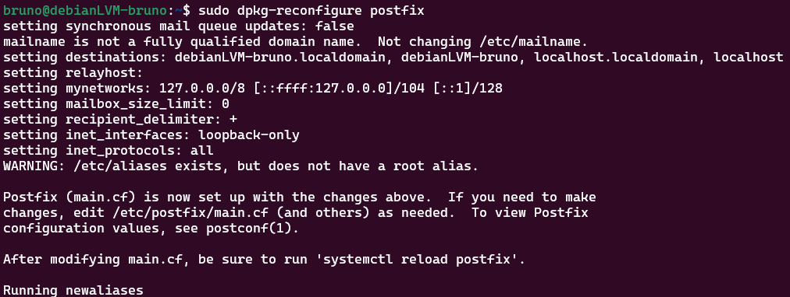
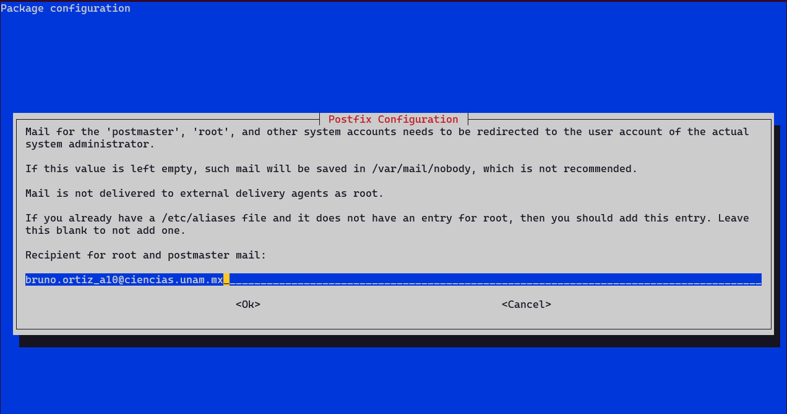

### `sudo nano /etc/aliases`
Abre el archivo /etc/aliases con nano para configurar alias de correo, que redirigen correos enviados a cuentas del sistema (por ejemplo, root) a direcciones de correo reales.

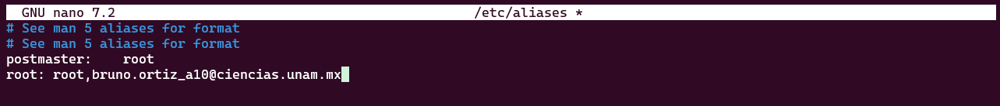

### `sudo newaliases`
Actualiza la base de datos de alias después de editar /etc/aliases. Esto permite que Postfix aplique los cambios y envíe correos a las nuevas direcciones de alias configuradas.

### `sudo mkdir /var/cache/logwatch`
Crea un directorio de caché para Logwatch. Esto almacena datos temporales y ayuda a Logwatch a manejar archivos grandes de registro.

### `sudo cp /usr/share/logwatch/default.conf/logwatch.conf /etc/logwatch/conf/`
Copia el archivo de configuración principal de Logwatch (logwatch.conf) al directorio de configuración en /etc. Aquí puedes personalizar los ajustes de los informes generados.

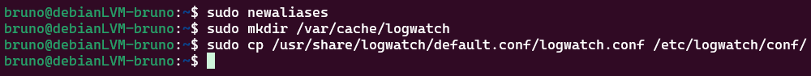

### `sudo nano /etc/logwatch/conf/logwatch.conf`
Abre el archivo logwatch.conf en nano para ajustar configuraciones, como el nivel de detalle del informe, el rango de tiempo y la dirección de correo a la cual se enviará el informe.


Modificamos el archivo con estas lineas:
```
#Output = stdout
Output = mail
```

Output = mail Este cambio en la configuración de Fail2Ban especifica el método de salida de los informes. Al cambiar Output de stdout (salida estándar) a mail, Fail2Ban enviará los informes y alertas por correo en lugar de imprimirlos en la terminal. Esto permite recibir notificaciones por correo electrónico sobre eventos, como intentos fallidos de inicio de sesión, bloqueos de IP, y otras alertas.

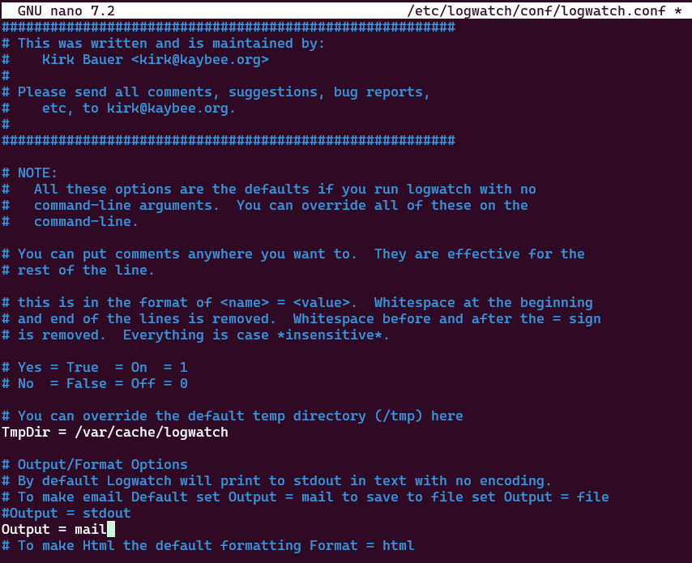

### `sudo logwatch --detail Low --range today`
Ejecuta Logwatch manualmente para generar un informe de baja profundidad (--detail Low) sobre la actividad de hoy (--range today). Este comando imprime el informe en la terminal o lo envía por correo si está configurado.

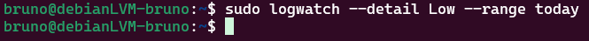

### `sudo cat /var/mail/root`
Muestra el contenido del buzón de correo de root, donde pueden llegar informes generados por Logwatch si no se han configurado alias de correo adicionales.

Los scripts en /etc/cron.daily/ y /etc/cron.weekly/ permiten automatizar escaneos e informes para una administración y seguridad regulares del sistema.
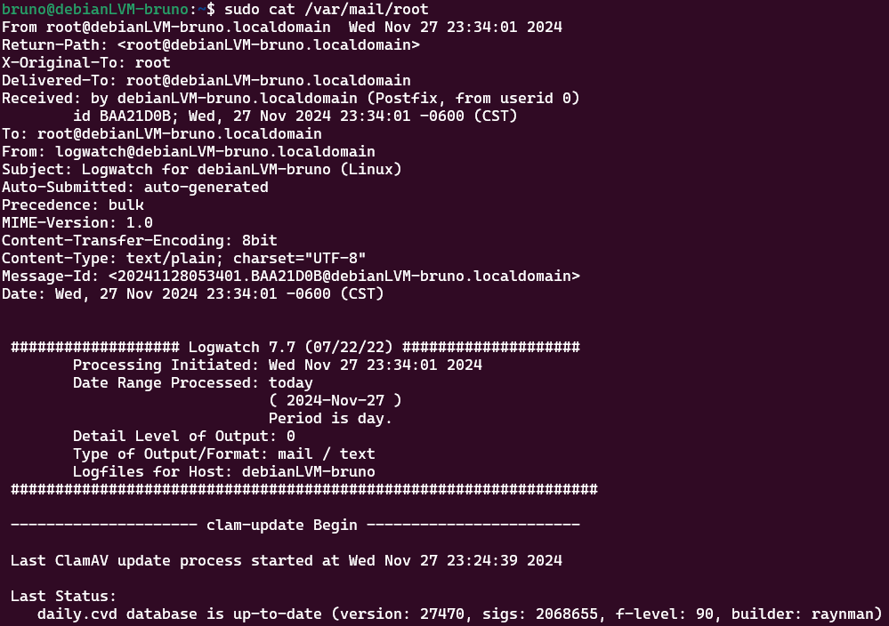

### `sudo nano /etc/cron.daily/00logwatch`

Abre el archivo de tareas diarias 00logwatch con nano. logwatch genera informes de actividad del sistema y registros importantes, y en este archivo puedes configurar o ajustar su frecuencia y contenido.

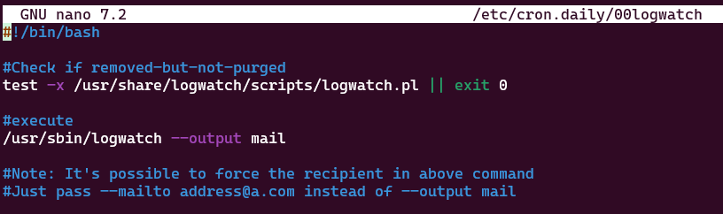

### `sudo nano /etc/cron.weekly/00logwatch`
Abre el archivo de tareas semanales 00logwatch para configurar escaneos e informes semanales del sistema
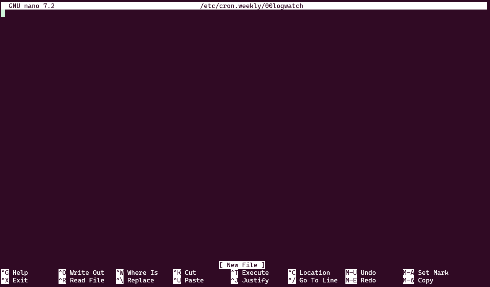


Esta configuración permite que el sistema envíe informes automáticos sobre la actividad diaria usando Postfix y Logwatch. Logwatch monitorea los registros del sistema, mientras que Postfix maneja el envío de estos informes por correo. Al configurar el archivo de alias y los informes diarios, puedes recibir notificaciones automáticas de posibles problemas, errores o eventos relevantes del sistema.